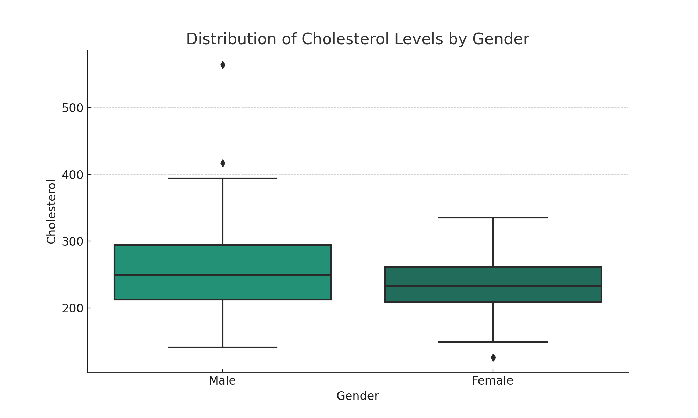
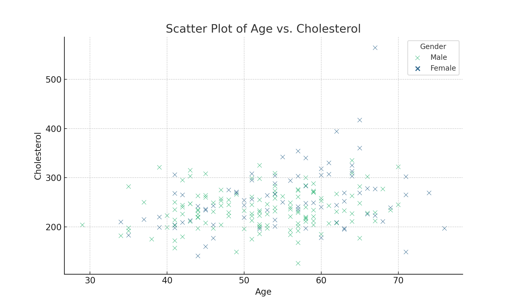
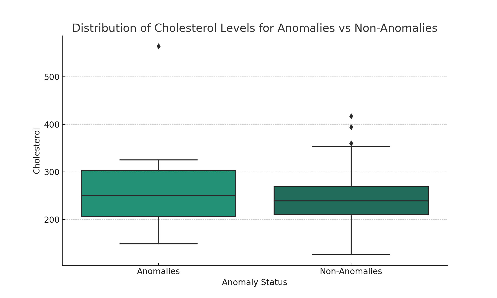

# Cholesterol Analysis

## Introduction
This repository contains a Jupyter Notebook (`cholesterol_analysis.ipynb`) that explores a dataset of cholesterol levels along with other health-related variables. The analysis includes visualizations, regression models, and anomaly detection, providing insights into the factors influencing cholesterol levels.

## Analyses Included

### 1. **Visualizations**:
   - Descriptive statistics and visualizations to understand the distribution of cholesterol levels by age, gender, and other factors.

### 2. **Regression Models**:
   - Simple Linear Regression to identify the relationship between age and cholesterol levels.
   - Multiple Linear Regression to understand the impact of age, resting blood pressure, max heart rate, and sex on cholesterol levels.

### 3. **Anomaly Detection**:
   - Implementation of the Isolation Forest algorithm to detect anomalies within the dataset, uncovering unique or medically significant patterns.

## Results and Conclusion
The analyses reveal complex relationships between cholesterol levels and various demographic and medical features, with age and gender emerging as key influencing factors. The detection of anomalies adds further depth, highlighting potential outliers or specific risk factors. The findings may have implications for healthcare professionals in predicting cholesterol levels and tailoring interventions.

## Dependencies
- Python
- Pandas
- NumPy
- Matplotlib
- Seaborn
- SciPy
- scikit-learn

## How to Use
1. Clone the repository.
2. Open the `cholesterol_analysis.ipynb` file in Jupyter Notebook or Jupyter Lab.
3. Run the cells to explore the analyses and visualizations.

## License
This project is available under the MIT License - see the [LICENSE.md](LICENSE.md) file for details.

## Contact
For any questions or collaboration, please feel free to contact the repository owner.

## Dataset Features
The dataset includes the following features:

- **Age**: Age of the individual.
- **Sex**: Gender of the individual (male/female).
- **Resting Blood Pressure**: Resting blood pressure measurement.
- **Cholesterol**: Serum cholesterol level.
- **Fasting Blood Sugar**: Fasting blood sugar level.
- **Resting ECG**: Resting electrocardiographic results.
- **Max Heart Rate**: Maximum heart rate achieved during a stress test.
- **Exercise Angina**: Exercise-induced angina (yes/no).
- **ST Depression**: ST depression induced by exercise relative to rest.
- **Slope of ST Segment**: Slope of the peak exercise ST segment.
- **Number of Major Vessels**: Number of major vessels colored by fluoroscopy.
- **Thalassemia**: Type of thalassemia.
- **Disease Status**: Presence or absence of heart disease.

# Key Visualizations

## Distribution of Cholesterol Levels by Gender

## Scatter Plot of Age vs. Cholesterol

## Anomalies in Cholesterol Levels

